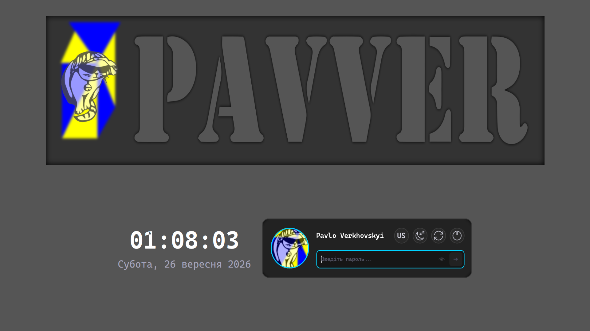
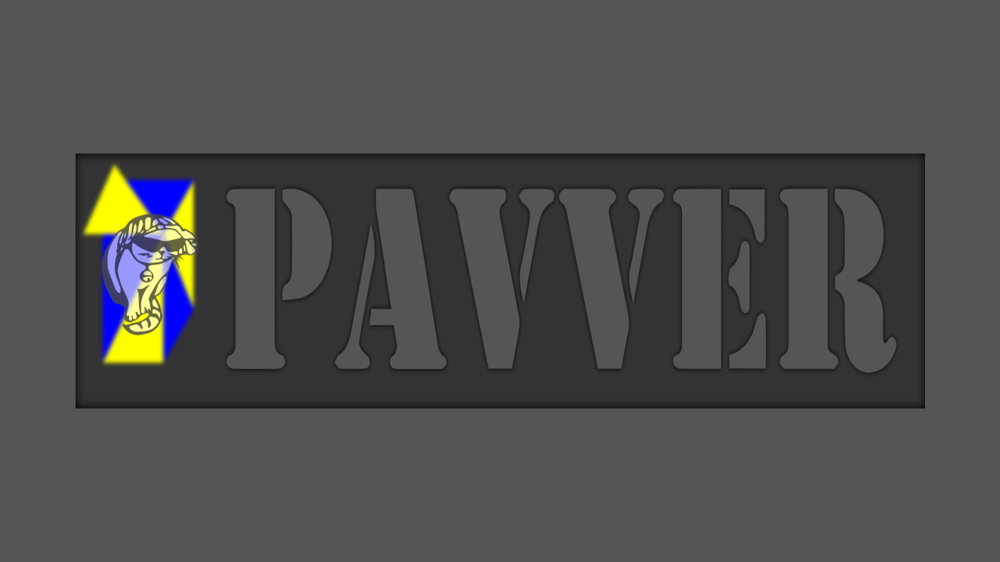

# Pavver Plasma Lock Screen Theme

<div align="center">
  
  
  <p><em>Фірмова адаптивна тема екрана блокування для <b>KDE Plasma 6</b> з динамічним режимом скрінсейвера, плавною кінематикою, типографікою Cascadia Code та тактильним зворотним зв'язком.</em></p>
</div>

---

## ✨ Особливості

- **🌌 Інтерактивний режим скрінсейвера (Screensaver Mode)**:
  - **Автоматична активація**: вмикається одразу при блокуванні системи, а також після 20 секунд простою (якщо поле вводу пароля порожнє).
  - **Фокус на геометрії та анімації**: годинник і картка вводу плавно ховаються вниз за межі екрана (`y = height + 70`, `opacity: 0.0`), курсор приховується.
  - **Центрування та пропорційне масштабування**: фірмовий прямокутний банер з котиком та анімованими трикутниками плавно переміщується точно в центр екрана, займаючи 85% ширини дисплея зі збереженням співвідношення `675:190`.
  - **Захист від випадкового пробудження**: після переходу в скрінсейвер діє таймер затримки (2.5 с), який запобігає миттєвому зриву анімації від випадкового дотику до миші чи відпускання клавіш.

- **⚡ Плавний вихід з режиму скрінсейвера (Fluid Wake-up)**:
  - Будь-який рух мишкою, клік або натискання будь-якої клавіші активує режим розблокування.
  - Синхронізована 550мс кінематика (`Easing.OutCubic`): банер плавно повертається у верхню частину екрана, годинник і картка піднімаються знизу на свої позиції, а поле пароля автоматично отримує фокус.

- **🎨 100% відповідність дизайн-системі SDDM**:
  - Точна піксельна відповідність темі входу [`pavver-sddm-theme`](https://github.com/pavver/pavver-sddm-theme).
  - Великі круглі кнопки дій `48 x 48 px` (Сон, Перезавантаження, Вимкнення) з векторними іконками `32 x 32 px` та фірмовими неоновими акцентами.
  - Чіткий перемикач розкладки клавіатури з великим шрифтом Cascadia Code `24 px` bold.
  - Круглий аватар користувача з неоновим бірюзовим контуром та автоматичним завантаженням системного фото з AccountsService.

- **📱 Адаптація до маленьких екранів (640×480 VGA / Safe Mode)**:
  - На компактних екранах (висота < 520 або ширина < 750), де в стандартному режимі банер приховується для економії місця, у режимі скрінсейвера він відображається по центру.
  - При виході зі скрінсейвера банер плавно виїжджає вгору за верхній край екрана (`y = -bannerHeight - 40`) з паралельним fade-out.

- **🔒 Оптимізовано спеціально для Lock Screen**:
  - Нативна інтеграція з API **Plasma 6 / kscreenlocker** (`authenticator.respond()`, `authenticator.startAuthenticating()`).
  - Повні системні дії (Сон, Перезавантаження, Вимкнення) через нативний `SessionManagement`.

- **💡 Тактильний фідбек автентифікації**:
  - **Успішне розблокування**: неоново-зелена пульсація контуру поля введення (`#00e676`) та миттєве розблокування (`Qt.quit()`) без зайвих лоадерів чи затримок.
  - **Помилка пароля**: поле миттєво очищується, контур поля двічі плавно пульсує червоним (`#ff3366`) та м'яко затухає. Жодного струшування чи смикання картки.

- **⚠ Індикатор Caps Lock**:
  - Висококонтрастний бейдж `[ ⚠ CAPS ]` із золотистим підсвічуванням розміщено ліворуч всередині поля введення пароля, акуратно зміщуючи текст праворуч при активації.

- **📦 100% автономність**:
  - Жодних зовнішніх мережевих запитів, CDN або сторонніх залежностей.
  - Векторні SVG та шрифт Cascadia Code вбудовані безпосередньо в пакет теми.

---

## 🚀 Встановлення

### Автоматичне встановлення

Клонуйте репозиторій та запустіть скрипт встановлення:

```bash
git clone https://github.com/pavver/pavver-plasma-lockscreen.git
cd pavver-plasma-lockscreen
./install.sh
```

> **Порада**: Якщо запустити без `sudo`, тема встановиться для поточного користувача (`~/.local/share/plasma/look-and-feel/pavver-plasma-lockscreen`). Якщо запустити з `sudo ./install.sh`, тема встановиться системно (`/usr/share/plasma/look-and-feel/pavver-plasma-lockscreen`).

Скрипт автоматично:
1. Скопіює структуру пакету Look-and-Feel Plasma 6.
2. Встановить необхідні права доступу (`755`).
3. Застосує конфігурацію через `kwriteconfig6` для `kscreenlockerrc` та `kdeglobals`.

---

### Ручне встановлення

1. Скопіюйте директорію теми до каталогу Look-and-Feel вашого користувача:
   ```bash
   mkdir -p ~/.local/share/plasma/look-and-feel/pavver-plasma-lockscreen
   cp -rf metadata.json contents ~/.local/share/plasma/look-and-feel/pavver-plasma-lockscreen/
   ```

2. Увімкніть тему блокування в налаштуваннях:
   ```bash
   kwriteconfig6 --file kscreenlockerrc --group Greeter --key Theme pavver-plasma-lockscreen
   ```
   *Або оберіть тему вручну в:* **Системні параметри KDE → Блокування екрана (Screen Locking) → Зовнішній вигляд**.

---

## 🔍 Тестування теми наживо

Ви можете протестувати екран блокування без блокування робочого сеансу за допомогою вбудованої утиліти KDE:

```bash
/usr/lib/kscreenlocker_greet --testing
```

Або запустити автономний QML-тест:
```bash
qml6 contents/lockscreen/LockScreen.qml
```

---

## 📂 Структура проєкту

```
pavver-plasma-lockscreen/
├── metadata.json                 # Декларація Plasma/LookAndFeel пакету (KDE Plasma 6)
├── install.sh                    # Інсталятор з автоконфігурацією kscreenlockerrc
├── preview.png                   # Прев'ю для Системних параметрів KDE
├── preview_unlock.png            # Знімок екрана в режимі розблокування
├── preview_screensaver.png       # Знімок екрана в режимі скрінсейвера
├── preview_capslock.png          # Знімок екрана з активним індикатором Caps Lock
├── contents/
│   └── lockscreen/
│       ├── LockScreen.qml        # Точка входу kscreenlocker
│       ├── LockScreenUi.qml      # Стейт-машина скрінсейвера та кінематика переходів
│       ├── assets/               # Векторні SVG іконки та графіка
│       ├── components/           # Модульні компоненти QML
│       │   ├── Clock.qml         # Векторний годинник та дата
│       │   ├── CompactLockCard.qml # Картка розблокування та SessionManagement
│       │   └── PavverAnimatedBackground.qml # Анімований банер з трикутниками
│       └── fonts/
│           └── CascadiaCode.ttf  # Вбудований моноширинний шрифт
```

---

## 📄 Ліцензія

Цей проєкт розповсюджується під ліцензією [GPL-3.0-or-later](LICENSE).
